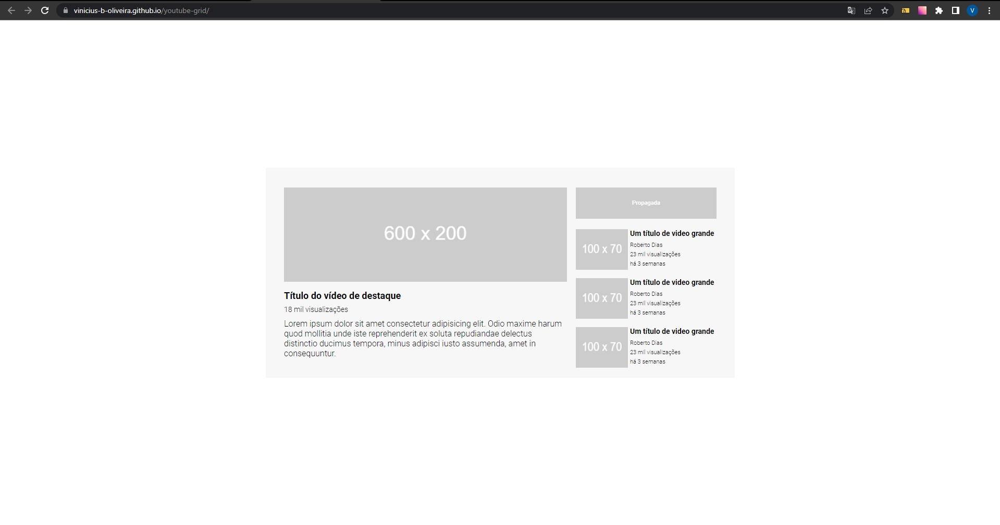

# Exercício Layout do Youtube com Grid do curso DevQuest

## Sumário

- [Visão Geral](#visão-geral)
  - [Desafio](#desafio)
  - [Print](#print)
  - [Links](#links)
- [Meu processo](#meu-processo)
  - [Tecnologias](#tecnologias)
  - [Pratica de Aprendizado](#pratica-de-aprendizado)
- [Autor](#autor)
- [Agradecimentos](#agradecimentos)

## Visão Geral

### Desafio

- Fazer o projeto da maneira mais fiel possível ao design do figma. 

### Print



### Links

- Solução: [Ir para solução](https://vinicius-b-oliveira.github.io/youtube-grid/)

## Meu Processo

### Tecnologias

- Marcação semantica com HTML 5
- Folhas de estilo em cascata no CSS 3
- Estilos flexiveis usando CSS Flexbox
- Layouts usando CSS Grid
- Armazenamento de propriedades usando variáveis CSS
- Git para versionamento de código

### Pratica de Aprendizado

Com esse projeto foi possível praticar algumas tecnologias CSS como o flex box e Grid em conjunto para formar um layout responsivo. 

Segue abaixo um trecho de código com os conhecimentos relatados acima: 
```css
main {
    background-color: #F7F7F7;
    max-width: 900px;
    display: grid;
    grid-template-areas: "principal propaganda"
                         "principal recomendados";
    grid-template-columns: 1fr 270px;
    padding: 38px 35px 19px 35px;
    gap: 20px 17px;
}

.videos-recomendados {
    grid-area: recomendados;
    display: flex;
    flex-direction: column;
    gap: 16px;
}
```

## Autor

- Github - [Vinicíus Bueno](https://github.com/Vinicius-b-oliveira)

## Agradecimentos

Projeto realizado durante o curso de programação [Dev Quest](https://devemdobro.com/matriculas-abertas/) sobre mentoria dos gêmeos Ricardo Dias e Roberto Dias. 
